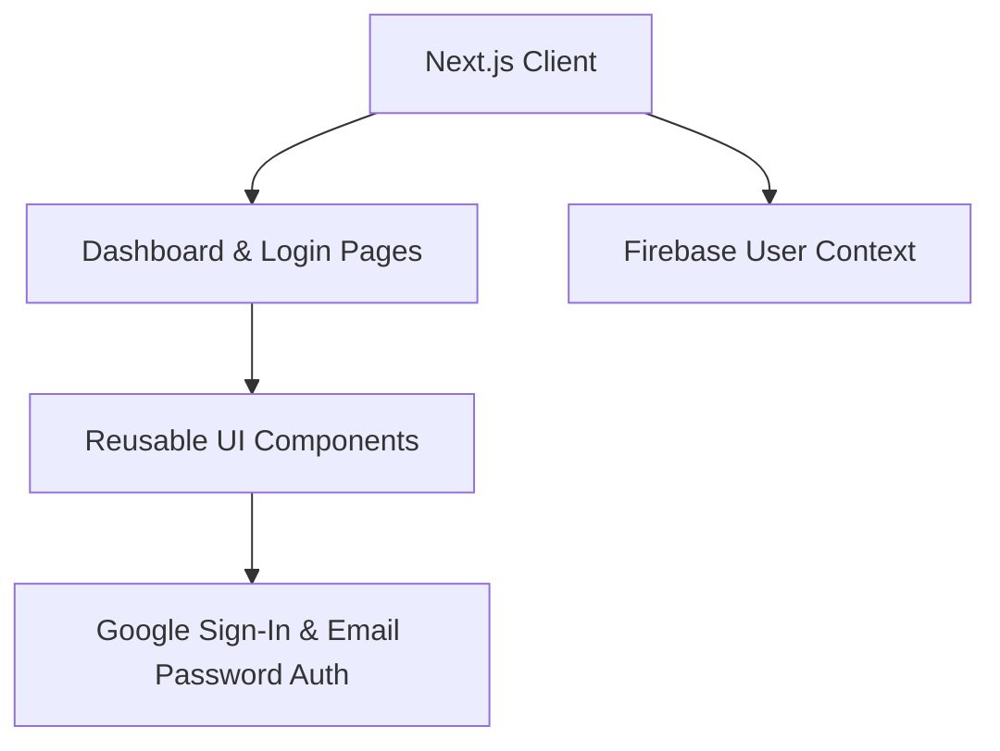

# Post-Quantum Blockchain PHR Security - Architecture Proof

## 1. Version Control Evidence
This document serves as proof of the UI and API skeleton setup, managed via strict version control and automated CI/CD pipelines.
- **Repository Context:** Hosted on GitHub (Post-Quantum PHR Security).
- **Branch Strategy:** Active development pushed securely to `main`.
- **Automated Validation:** Github Actions strictly enforce linting and build checks before allowing Docker container registry updates.

## 2. UI Skeleton Structure
The front-end is developed using **Next.js 15+ (App Router)** with **Tailwind CSS**, providing a high-performance, dark-mode, futuristic user interface with fluid glassmorphism elements.

## 3. API & Backend Skeleton
The modular backend architecture is split between Edge-compatible Next.js APIs and Dockerized Python services:
- `frontend/src/app/api/auth/*` - Handles Firebase-authenticated session flows and related frontend auth helpers.
- `backend/main.py` - Dockerized Python FastAPI skeleton intended for intensive cryptographic transformations (Kyber-1024 simulations).
- `contracts/PHR.sol` - Solidity Smart Contracts deployed for mapping IPFS hashes to Ethereum public addresses logically.

> [!NOTE] 
> This architecture proof satisfies the requirement for "Architecture Proof: UI/API skeleton with version control evidence."
