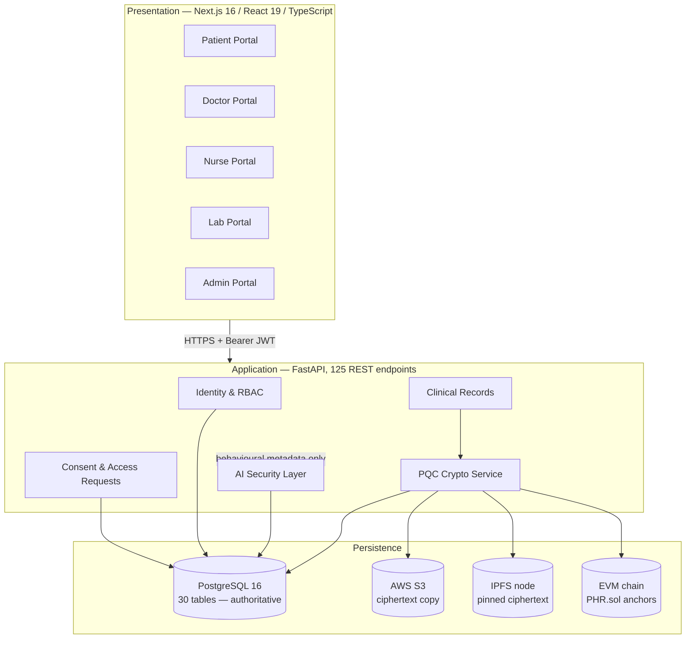

# 1. System Architecture

QuantumCare is a post-quantum secure healthcare record system. Five roles —
Patient, Doctor, Nurse, Lab Technician, Administrator — interact with clinical
records that are encrypted at rest, signed, anchored on-chain, and watched for
misuse by a behavioural security layer.

## Layered architecture

## Technology stack

| Layer | Technology |
|---|---|
| Frontend | Next.js 16, React 19, TypeScript, Tailwind CSS |
| Backend | Python 3.12, FastAPI, Pydantic v2, psycopg 3 |
| Database | PostgreSQL 16 |
| Post-quantum crypto | liboqs 0.16 — ML-KEM-768 (FIPS 203), ML-DSA-65 (FIPS 204) |
| Symmetric crypto | AES-256-GCM (documents), AES-256-CBC (columns), Argon2id (passwords) |
| Blockchain | Solidity `PHR.sol`, EVM (Foundry/anvil local chain) |
| Object storage | AWS S3 (eu-north-1), ciphertext only |
| Content addressing | IPFS (kubo 0.43) — real pinning to a local node |
| CI/CD | GitHub Actions, Docker |

## Key architectural decisions

**The database is authoritative.** S3 and IPFS hold redundant copies of the same
ciphertext. A read falls back through them in order, so losing one store does
not lose the record.

**Only digests reach the chain.** `PHR.sol` records SHA-256 digests, actors and
actions — never the document, never key material. An attacker with full database
access can rewrite a stored hash but cannot alter the one already committed
on-chain, so the two stop agreeing and verification raises an integrity alert.

**Hybrid encryption, three distinct jobs.** AES-256-GCM encrypts the document
because symmetric encryption handles bulk data efficiently; ML-KEM-768
encapsulates only its 32-byte key; ML-DSA-65 signs the digest to prove
authorship. Describing any one of these as doing another's job is the most
common way such architectures are misrepresented.

**The AI layer observes; it never authorises.** Authentication, RBAC,
relationship and consent decide access. The security layer receives an event
only after that decision and cannot feed back into it.

## Source map

| Path | Responsibility |
|---|---|
| `backend/app/main.py` | 125 REST endpoints, request handling, authorization |
| `backend/app/crypto_service.py` | ML-KEM / ML-DSA / AES-GCM primitives |
| `backend/app/security.py` | Argon2id, column encryption, session tokens |
| `backend/app/rbac.py` | Role requirements per endpoint |
| `backend/app/storage_service.py` | S3 upload/download, IPFS publish/fetch |
| `backend/app/anchor_service.py` | On-chain anchoring and verification |
| `backend/app/ai_security.py` | Anomaly detection, XAI, FedAvg |
| `backend/app/zkp_service.py` | Zero-knowledge consent proofs |
| `backend/app/lab_catalog.py` | 9 lab panels — drives both form and PDF |
| `backend/db/init.sql` | 30-table schema |
| `contracts/PHR.sol` | Integrity anchor contract |
| `frontend/src/app/dashboard/*` | Five role portals, 50 pages |
