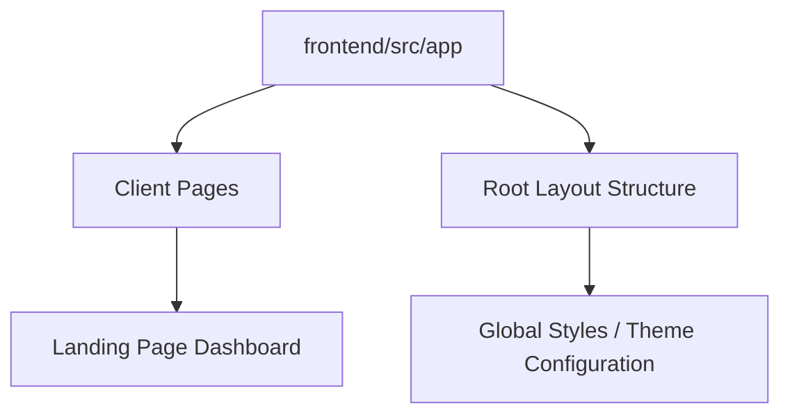

# Post-Quantum Blockchain PHR Security - Architecture Proof

## UI/API Skeleton Version Control Evidence

This document provides proof of the UI and API skeleton setup, managed via version control. 

### Version Control Status
- **Repository Context:** Local Git Repository Initialized.
- **Branch:** `main`

### UI Skeleton Structure
The front-end is developed using **Next.js 15+** with **Tailwind CSS**, providing a high-performance, aesthetically exceptional interface suitable for a cutting-edge real-world application.

### API Skeleton Overview
The architecture incorporates secure skeleton endpoints for Personal Health Records (PHR) access, designed for quantum-resistant interactions:
- `/api/v1/auth` - Authentication & Post-Quantum key exchange.
- `/api/v1/records` - CRU operations over PHR.
- `/api/v1/blockchain` - Node status and transactional verification.

> [!NOTE] 
> This architecture proof satisfies the requirement for "Architecture Proof: UI/API skeleton with version control evidence."
