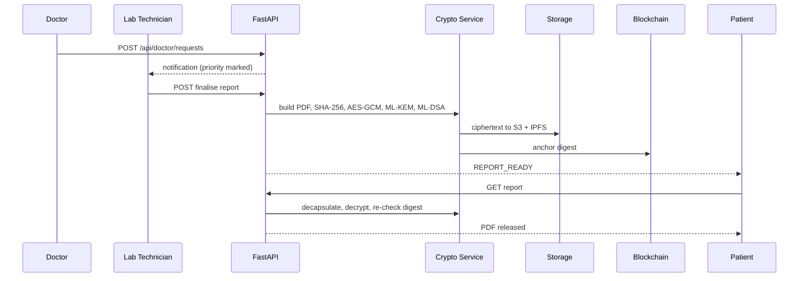

# 2. Module Breakdown

Seven backend modules and five role portals. Each module states what it owns,
what it depends on, and what it deliberately does not do.

## Backend modules

### 1. Identity & RBAC — `security.py`, `rbac.py`, `user_id_service.py`
Registration, admin approval, Argon2id passwords, JWT sessions recorded in a
`Sessions` table so they can be counted and revoked. Every protected endpoint
declares the role it requires.

Permanent public IDs (`PAT-2026-000001`) come from an atomic per-role, per-year
counter. **Post-quantum keypairs are issued only on approval**, so a pending or
rejected account never holds usable key material.

### 2. Consent & Access Requests — `main.py`
A doctor already treating a patient reads the chart on that relationship.
A doctor with no relationship must request access, stating a clinical purpose of
at least a sentence; the patient approves or declines and **the backend enforces
that decision**. Revocation and rejection both block reads.

Consent is one table with a status lifecycle — `Pending → Authorized / Rejected
→ Revoked` — rather than two tables, because a request and a consent are the
same relationship at different stages and splitting them would give two answers
to "may this doctor read this patient".

### 3. Clinical Records — `main.py`, `lab_catalog.py`, `report_pdf.py`
Diagnoses, prescriptions, vitals, nursing notes, medication rounds,
consultations, appointments, lab requests and reports, imaging.

Nine lab panels (CBC, Blood Sugar, LFT, KFT, Lipid, Thyroid, Urine, ECG,
Radiology) drive both the data-entry form and the printed PDF from one
definition, so the two cannot drift apart.

### 4. PQC Crypto Service — `crypto_service.py`
ML-KEM-768 key encapsulation, ML-DSA-65 signatures, AES-256-GCM document
encryption, SHA-256 digests.

**Fails loudly.** If liboqs is unavailable the service raises rather than
substituting placeholder keys — a fake keypair that looks real in the database
voids every downstream guarantee while appearing healthy.

### 5. Storage — `storage_service.py`
S3 upload/download and IPFS publish/fetch, ciphertext only. The AES key never
leaves the process, so an S3 object or IPFS block on its own discloses nothing.
Records an object key **only when the object exists**.

### 6. Blockchain Anchoring — `anchor_service.py`, `chain_client.py`, `PHR.sol`
Writes actor, action and SHA-256 digest on-chain for every finalised document,
break-glass declaration and consent decision. When no chain is reachable the
anchor is labelled `local-simulated` with no block number, so a simulated anchor
can never be mistaken for a real one.

### 7. AI Security Layer — `ai_security.py`
Behavioural anomaly detection over access metadata, explainable risk scoring,
alerts, incidents, and federated aggregation. **Reads how records are touched,
never what they contain** — a detector that needed to read diagnoses to spot
misuse would itself be the largest privacy hole in the system.

## Frontend portals

| Portal | Key screens |
|---|---|
| **Patient** | Records, lab reports, documents, scans, vitals, prescriptions, medication history, appointments, access requests, record access, security centre |
| **Doctor** | Patient roster and chart, diagnoses, prescriptions, lab requests, access requests, imaging, reports, appointments, emergency access |
| **Nurse** | Patient chart, vitals entry, nursing notes, medication rounds |
| **Lab Technician** | Request queue, 9 structured report forms, imaging upload, report directory |
| **Administrator** | Registrations, users, audit logs, security centre, emergency access review, AI security dashboard |

## Module interaction — filing a lab report

