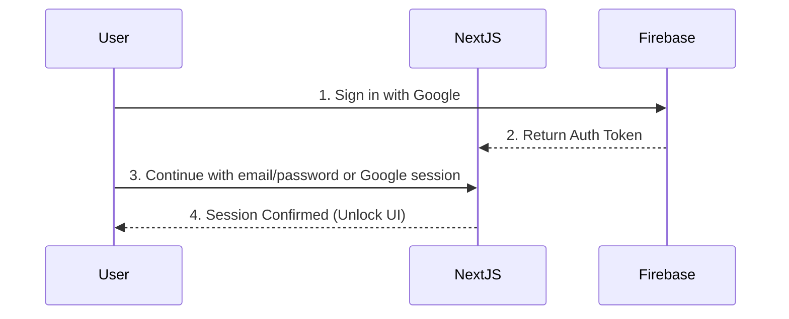
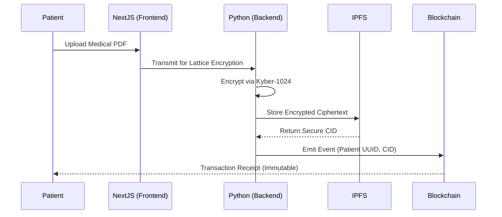

# System Flow & Mapping

## 1. Authentication & Key Exchange Flow
The initial point of entry is protected by hybrid security paradigms mapping identity directly to sessions.

## 2. Personal Health Record (PHR) Upload Flow
When a patient uploads a diagnosis or lab report, the underlying mapping behaves as a strict pipeline:

## 3. Data Flow Mapping Matrix
- **React Context / LocalStorage:** Maintains ephemeral session states and UI theming (e.g., Dark Mode preferences) away from the database.
- **Next.js API Routes:** Frontend auth flows rely on Firebase Authentication helpers; no SMS or phone verification services are used.
- **Solidity Ledger (`PHR.sol`):** Maps unique patient identifiers directly to an array of authorized Doctor Ethereum wallet addresses. 

> [!TIP]
> This completes the requirement: "System Flow: Clear presentation of design, flows, and mapping" by providing granular UML mapping matrices.
