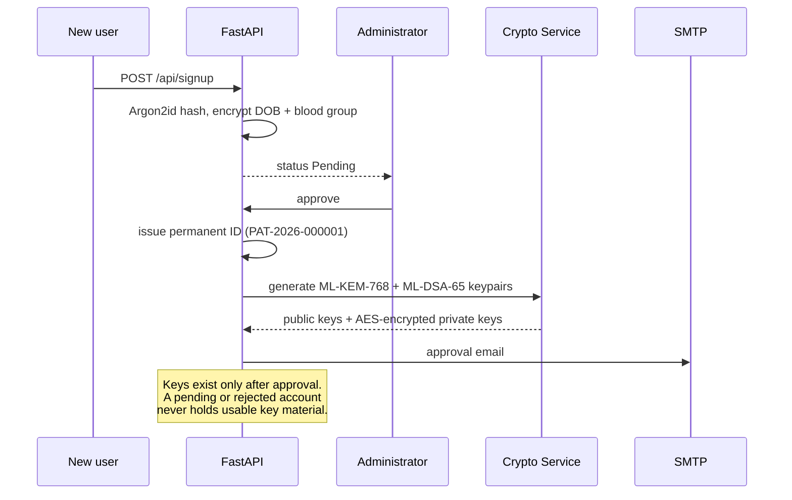
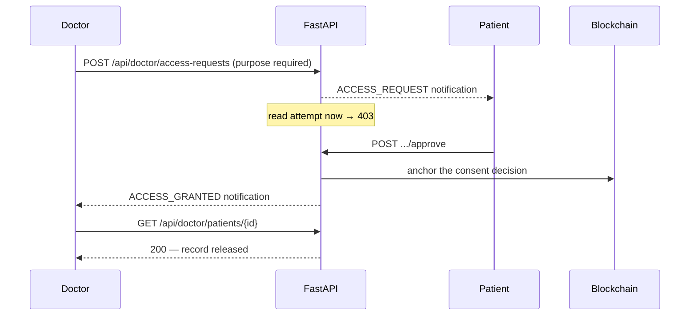
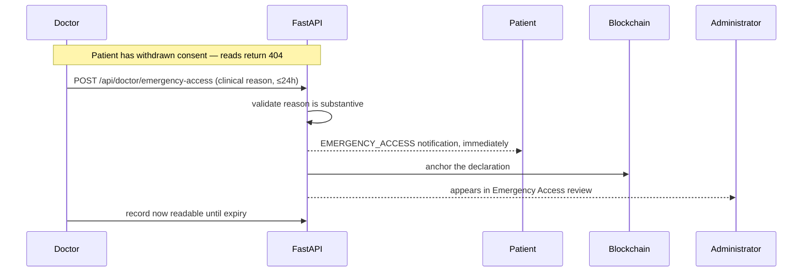
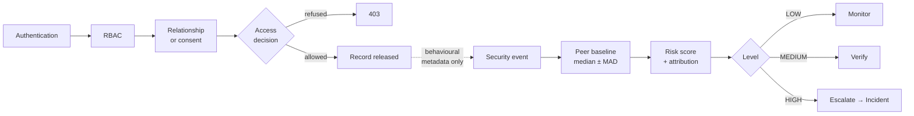

# 7. System Flows

The four sequences the system has to get right.

## 1. Registration → approval → usable account

## 2. Doctor requests access → patient decides → backend enforces

**Verified end to end:** no request `403` · pending `403` · rejected `403` ·
approved `200`. A different patient approving by substituted request id gets
`404`.

## 3. Doctor → laboratory → patient (the main clinical workflow)

```mermaid
flowchart LR
    A[Doctor orders<br/>investigation] --> B[Lab queue<br/>priority ordered]
    B --> C[Structured form<br/>1 of 9 panels]
    C --> D[Hospital PDF]
    D --> E[SHA-256]
    E --> F[AES-256-GCM]
    F --> G[ML-KEM-768<br/>wraps AES key]
    G --> H[ML-DSA-65<br/>signs digest]
    H --> I[(DB + S3 + IPFS)]
    I --> J[Chain anchor]
    J --> K[Notify patient<br/>and doctor]
    K --> L[Verified read<br/>digest re-checked]
```

## 4. Emergency break-glass

Break-glass is deliberately **not** gated on approval — waiting for a second
party in an emergency defeats the purpose. The control is accountability, not
prevention: the reason must be substantive, the override is time-boxed, the
patient is told at once, and the declaration is anchored so it cannot be quietly
removed.

## 5. Security event → risk → alert → incident

Nothing produced by the AI layer feeds back into the access decision. It can
raise an alarm about a read; it cannot authorise or prevent one.
