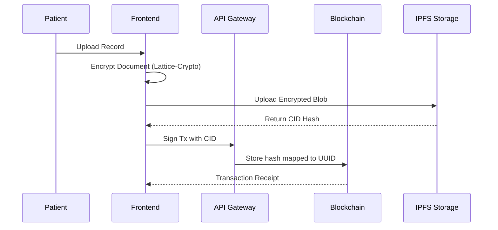

# System Flow & Mapping

## Execution Workflows
The mapping follows the Model-View-Controller (MVC) and Microservice intercommunication rules.

### 1. Patient Registration & Login Flow
- Patient access Next.js interface.
- App verifies credentials locally and communicates via API.
- Upon success, the system creates a session encrypted with post-quantum parameters.

### 2. PHR Upload Flow

### 3. State Mapping Matrix
- `React Context`: Manages active user role and UI theming state.
- `Next.js API Routes`: Maps REST calls to Web3.js / Ethers.js functions.
- `Solidity Ledger`: Maps unique patient identifiers to an array of authorized doctor addresses.

> [!TIP]
> This completes the requirement: "System Flow: Clear presentation of design, flows, and mapping."
