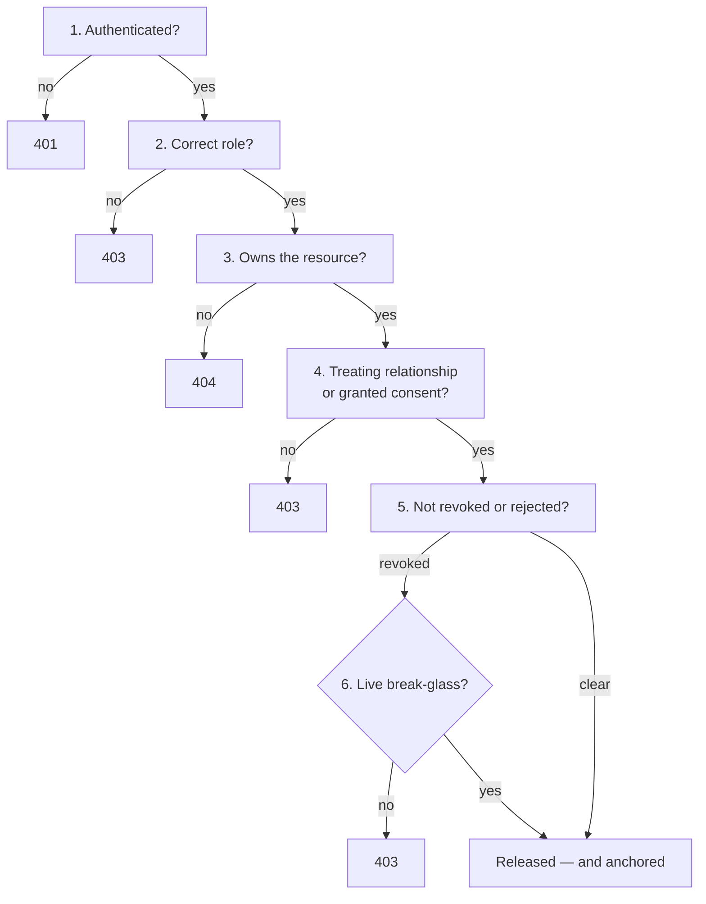
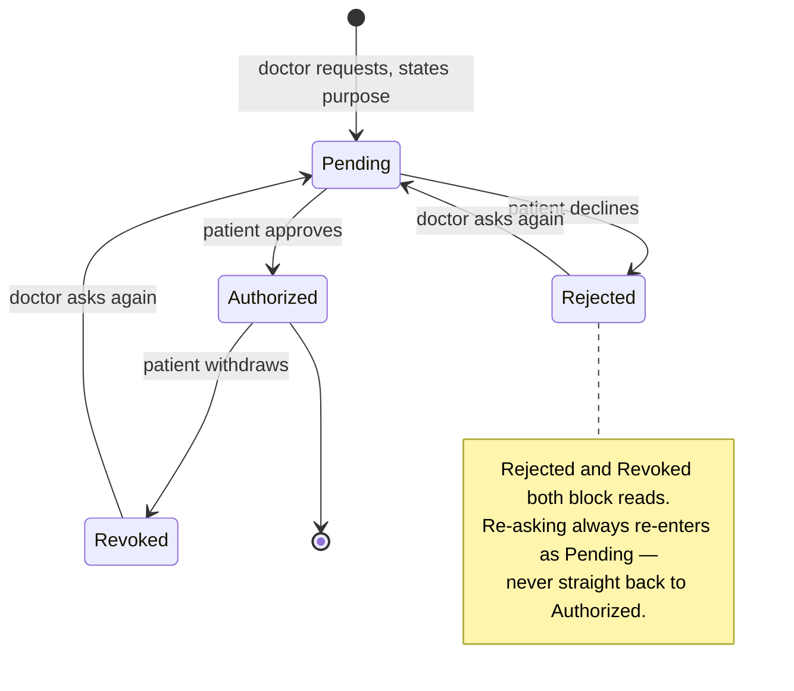

# 8. Identity, Access & Consent

Six checks stand between a user and a record. Frontend route protection is not
one of them — it is convenience, and every rule below is enforced server-side.

## Authentication

| Control | Implementation |
|---|---|
| Password storage | Argon2id, memory-hard, per-user salt |
| Session token | JWT, 30-minute expiry |
| Session record | `Sessions` table — countable and revocable |
| Audit | Every attempt to `AuthLogs`, success and failure |

There is **no Firebase, no Google Sign-In, and no third-party identity
provider**. Authentication is self-contained.

## Authorization — the six gates

## Roles

| Role | May read | May write |
|---|---|---|
| **Patient** | Own records only | Appointments, consent decisions |
| **Doctor** | Patients they treat, or who consented | Diagnoses, prescriptions, consultations, lab requests |
| **Nurse** | Assigned patients | Vitals, nursing notes, medication rounds |
| **Lab Technician** | Requests assigned to them | Lab reports, imaging |
| **Administrator** | Users, audit, security | Approvals, account status |

Administrative visibility and medical-record access are separate concepts: an
administrator manages accounts and reads audit trails, and is not thereby
entitled to clinical content.

## Consent lifecycle

Two routes to a record coexist deliberately. A doctor **already treating** the
patient reads on that relationship; making an oncologist file a form before
opening the chart of someone they are actively treating is the kind of
obstruction clinicians route around. A doctor with **no** relationship has no
implicit access and must ask.

The purpose field requires a real sentence. The patient reads it to decide, and
consent given on no information is not informed consent — so `"urgent"` is
refused before it reaches the database.

## Zero-knowledge consent proofs

A doctor can prove to a third party that a patient consented **without
revealing** the patient identifier, the doctor identifier, or the consent
record. Implemented as a Schnorr-style non-interactive proof over a
challenge–response, with challenges single-use to prevent replay.

## Emergency access

Time-boxed to at most 24 hours, requires a substantive clinical reason,
notifies the patient immediately, is written to the audit log and anchored
on-chain, and appears in the administrator's review queue. An override that
never expired would be a bypass, not an override.

## Verified

| Check | Result |
|---|---|
| Cross-role probes across all endpoints | 224 / 224 refused |
| Unrelated doctor reads a chart | `403` |
| Access request pending | `403` |
| Access request rejected | `403` |
| Access request approved | `200` |
| Another patient decides a request | `404` |
| Throwaway purpose (`"urgent"`) | `422` |
