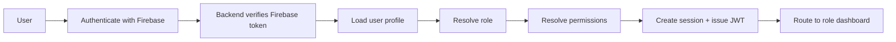
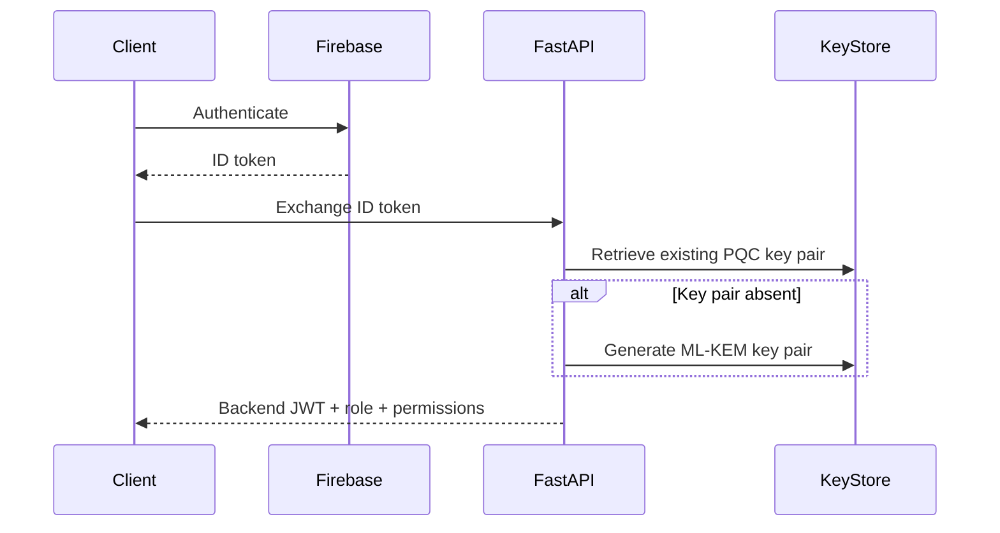

# Enterprise IAM Architecture for Enhanced PHR Security

## 1. Identity Model
- Authentication source: Firebase Authentication.
- Login methods: Google Sign-In and Email/Password.
- Backend trust boundary: FastAPI verifies the Firebase ID token, issues a short-lived backend JWT, and binds a server-side session.
- Persistent identity: each Firebase UID maps to one stable application user record.

## 2. Role Model
Supported roles:
- Patient
- Doctor
- Laboratory Staff
- Administrator
- AI Security Analyst

Future roles:
- Insurance Provider
- Pharmacist
- Hospital Receptionist
- Researcher

## 3. RBAC Matrix

## 4. Database Schema
Core tables:
- Roles
- Permissions
- RolePermissions
- Users
- UserKeys
- Sessions
- AuditLogs
- MedicalRecords
- Consent
- EmergencyAccess
- Notifications

## 5. Key Management

## 6. Authorization Flow
Every request is evaluated against:
- Authentication
- Role
- Permission
- Ownership
- Consent
- Session validity
- Risk score

Routes returning unauthorized access should fail closed with `403 Forbidden`.

## 7. Blockchain Audit Logging
Events written to blockchain:
- Login
- Logout
- Consent granted
- Consent revoked
- Medical record upload
- Medical record download
- Emergency access
- Key rotation
- Permission change
- Role assignment

## 8. Frontend Route Map
- `/login`
- `/signup`
- `/dashboard/patient`
- `/dashboard/doctor`
- `/dashboard/laboratory`
- `/dashboard/admin`
- `/dashboard/security`
- `/forbidden`

## 9. Backend API Surface
- `POST /api/auth/firebase/session`
- `GET /api/auth/me`
- `POST /api/auth/logout`
- `GET /api/roles`
- `GET /api/dashboard/{role}`
- `POST /api/records/upload`
- `POST /api/consent/grant`
- `POST /api/consent/revoke`
- `POST /api/keys/rotate`
- `POST /api/audit/log`

## 10. Deployment Notes
- Next.js frontend runs on the web tier.
- FastAPI runs on the API tier.
- PostgreSQL stores RBAC, session, consent, audit, and key metadata.
- Firebase stores authentication identities.
- Firestore or MinIO can be used for secondary storage or document blobs.
- Hyperledger Fabric stores immutable audit proofs and security events.
