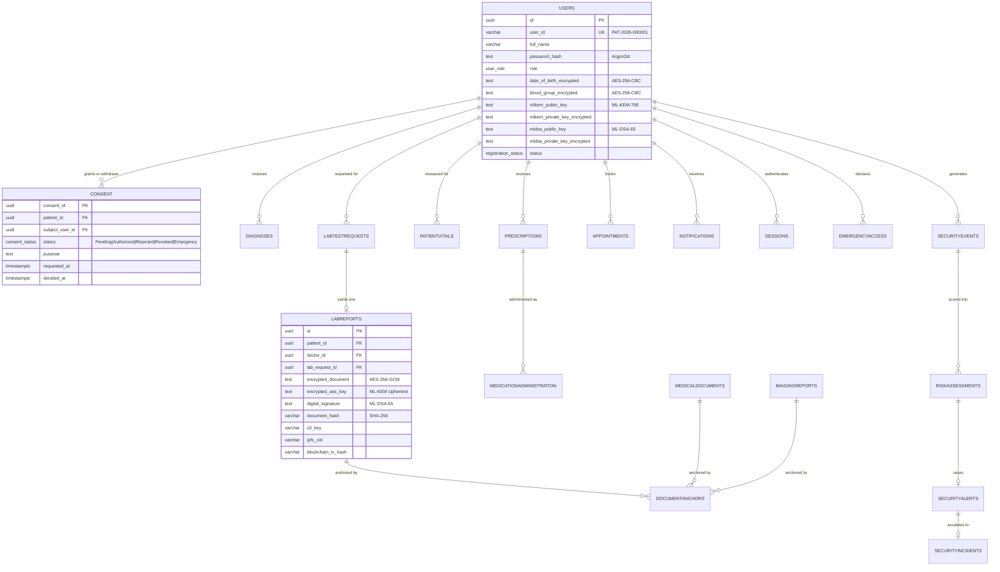

# 9. Database Schema

30 tables in PostgreSQL 16, grouped by responsibility. The database holds the
authoritative copy of every record; S3 and IPFS are redundant stores.

## Entity relationships (core clinical path)

## Tables by group

### Identity & access — 6 tables
| Table | Cols | Purpose |
|---|---|---|
| `users` | 20 | Accounts, encrypted PII, PQC keypairs |
| `sessions` | 9 | Active JWT sessions, revocable |
| `useridsequences` | 4 | Atomic per-role, per-year ID counter |
| `consent` | 17 | Access requests and consent lifecycle |
| `emergencyaccess` | 9 | Break-glass declarations, time-boxed |
| `zkpchallenges` | 8 | Zero-knowledge consent proof challenges |

### Clinical records — 10 tables
| Table | Cols | Purpose |
|---|---|---|
| `diagnoses` | 11 | Encrypted clinical text |
| `prescriptions` | 10 | Encrypted medicine, dosage, instructions |
| `patientvitals` | 13 | Nurse-recorded observations |
| `nursingnotes` | 6 | Observation / Care / Incident |
| `medicationadministration` | 7 | Administered / Refused / Held / Missed |
| `doctorconsultations` | 8 | Visit records |
| `appointments` | 10 | Booking lifecycle |
| `labtestrequests` | 13 | Investigation orders |
| `labreports` | 34 | Encrypted report + full crypto metadata |
| `imagingreports` | 22 | Encrypted studies |
| `medicaldocuments` | 19 | Discharge summaries, referrals |

### Audit & integrity — 4 tables
`documentanchors` (13) · `adminauditlogs` (9) · `authlogs` (8) · `emailnotifications` (10)

### AI security — 7 tables
`securityevents` (10) · `riskassessments` (11) · `securityalerts` (10) ·
`securityincidents` (16) · `federatedrounds` (7) · `federatedglobalmodel` (7) ·
`federatedpeers` (8)

### Deprecated — 1 table
`medicalrecords` (12) — dead schema from an earlier design, 0 rows, 0 code
references. Marked deprecated rather than dropped unilaterally.

## Encryption at rest

| Data | Protection |
|---|---|
| Passwords | Argon2id (memory-hard, per-user salt) |
| Date of birth, blood group | AES-256-CBC column encryption |
| Diagnoses, prescriptions | AES-256-CBC column encryption |
| Lab reports, imaging, documents | AES-256-GCM, key wrapped by ML-KEM-768 |
| PQC private keys | AES-encrypted before storage |

Grepping the database for a condition name such as "Diabetes" returns **0 rows**
across 810 diagnoses, while the patient portal displays the text correctly.

## Indexing

Indexes back the access paths that run per request: audit log by admin and by
time, security events by actor and by type, consent by patient and status,
notifications by user. Deep pagination measured the same as page one
(8 ms at page 1 and page 26 of the admin user list), confirming the list
endpoints are not scanning whole tables.
